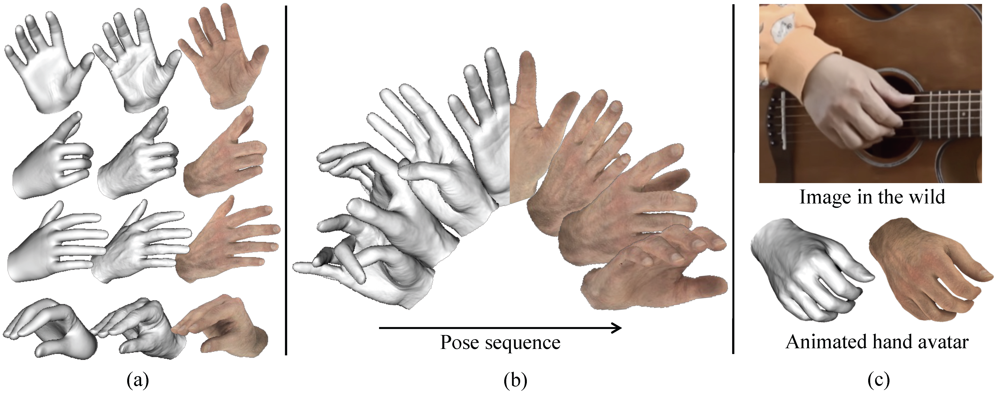

<h3>XHand: Real-time Expressive Hand Avatar</h3>

[Qijun Gan](https://github.com/agnJason), Zijie Zhou, [Jianke Zhu](https://scholar.google.cz/citations?user=SC-WmzwAAAAJ):email:
 
Zhejiang University

(:email:) corresponding author.

### News
* Our source code is coming soon. Please stay tuned! ☕️

## Abstract

Hand avatars play a pivotal role in a wide array of digital interfaces, enhancing user immersion and facilitating natural interaction within virtual environments. While previous studies have focused on photo-realistic hand rendering, little attention has been paid to reconstruct the hand geometry with fine details, which is essential to rendering quality. In the realms of extended reality and gaming, on-the-fly rendering becomes imperative. To this end, we introduce an expressive hand avatar, named XHand, that is designed to comprehensively generate hand shape, appearance, and deformations in real-time. To obtain fine-grained hand meshes, we make use of three feature embedding modules to predict hand deformation displacements, albedo, and linear blending skinning weights, respectively. To achieve photo-realistic hand rendering on fine-grained meshes, our method employs a mesh-based neural renderer by leveraging mesh topological consistency and latent codes from embedding modules. During training, a part-aware Laplace smoothing strategy is proposed by incorporating the distinct levels of regularization to effectively maintain the necessary details and eliminate the undesired artifacts. The experimental evaluations on InterHand2.6M and DeepHandMesh datasets demonstrate the efficacy of XHand, which is able to obtain high-fidelity geometry and texture for hand animations across diverse poses in real-time.

## Introduction

We present XHand, a rigged hand avatar that captures the  geometry, appearance and poses of the hand. XHand is created from multi-view videos and utilizes MANO pose parameters (the first image in each group of (a)) to generate high-detail meshes (the second) and renderings (the third). XHand generates photo-realistic hand images in real-time for a given pose sequence (b). (c) is an example of animated personalized hand avatars according to poses in the wild images.

